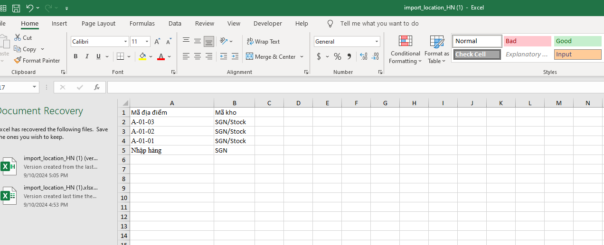
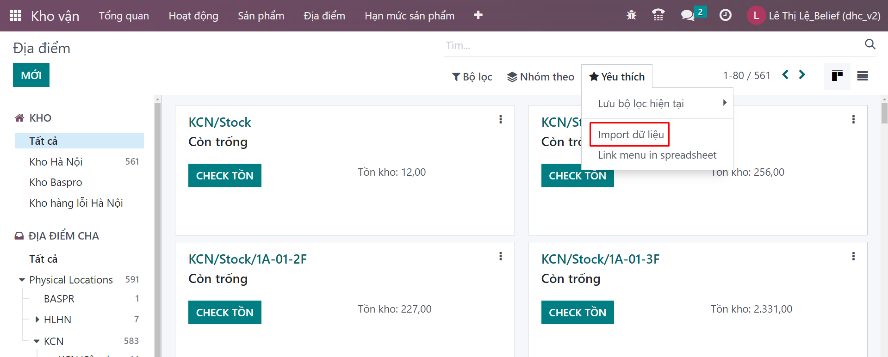
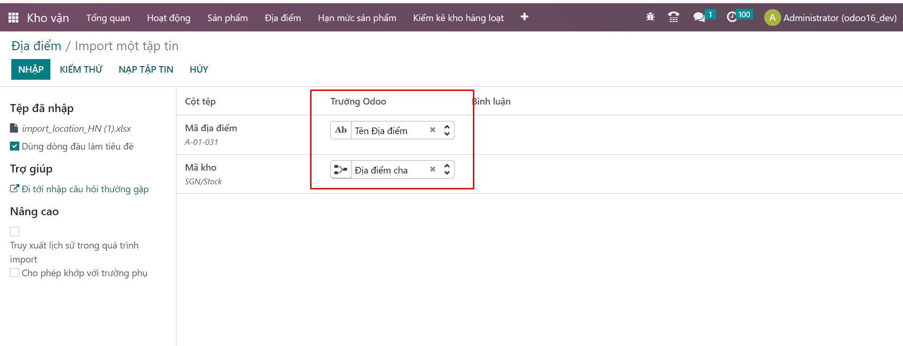
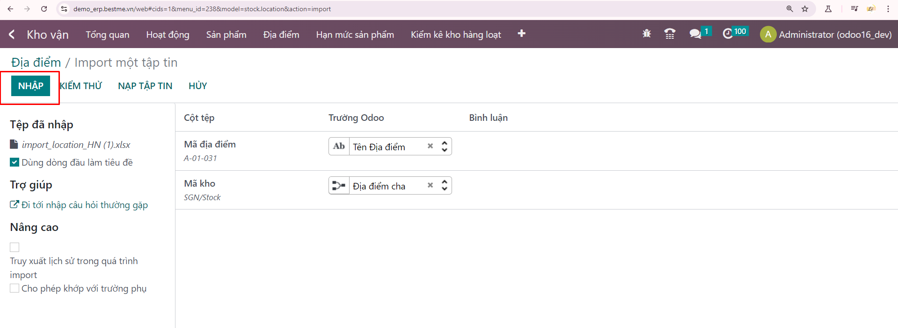
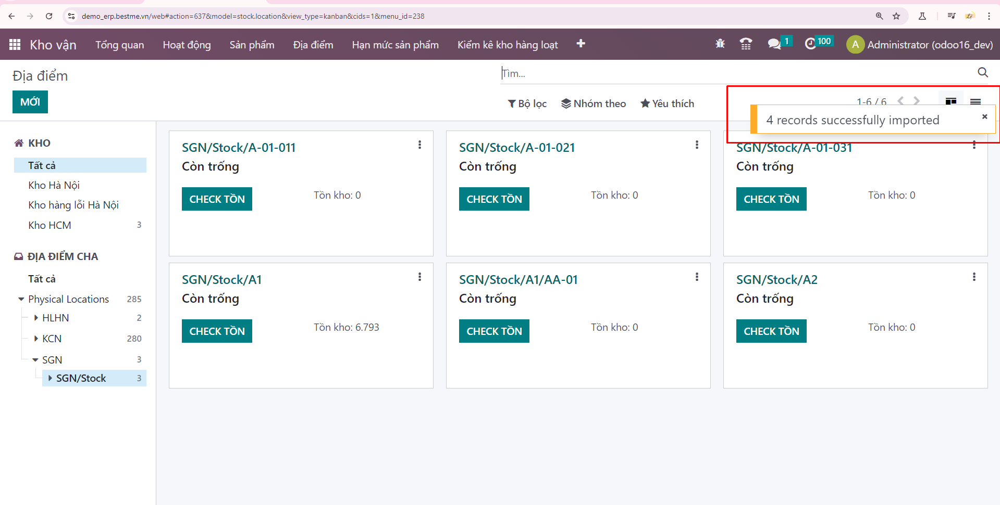
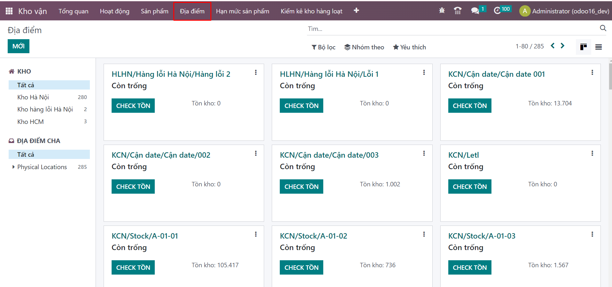
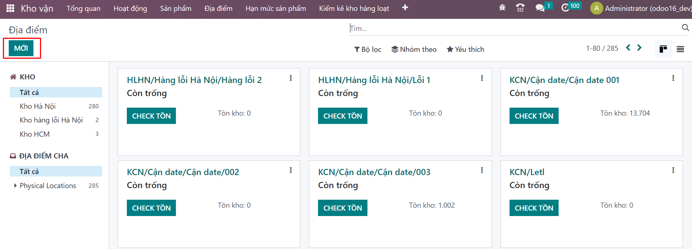
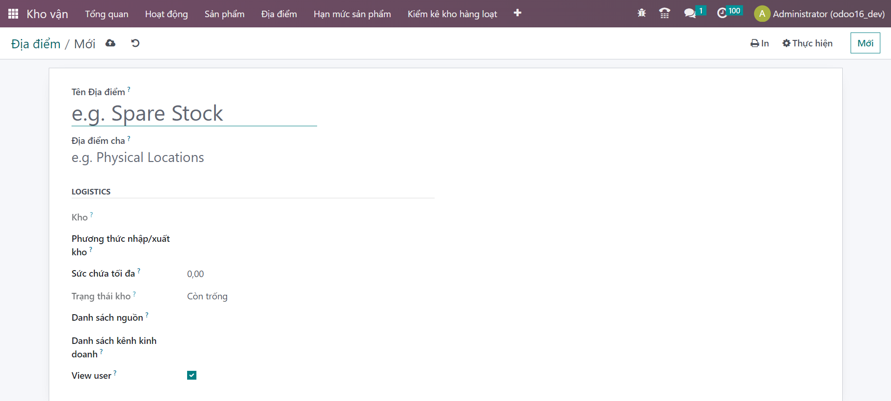
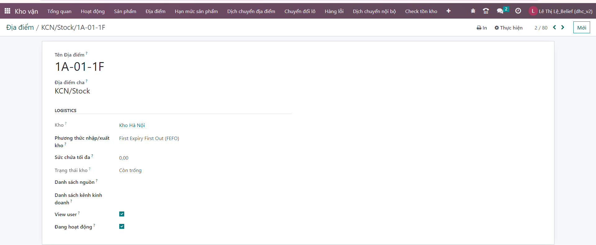

# Khai báo nhiều địa điểm cùng lúc 
## Import danh sách địa điểm

**Bước 1** Chuẩn bị một file excel với template như sau: <a href="https://docs.google.com/spreadsheets/d/1iOpB64-xxqQDRcU316Q3qLnnRLh2-ZIu/edit?usp=sharing&ouid=108648371589983090109&rtpof=true&sd=true">Template_import_location_HN</a>

+ Mã địa điểm: là mã người dùng đặt (lưu ý không nên đặt các ký tự đặc biệt để tránh sau này khó quét được mã vạch)
+ Mã kho: là tên viết tắt của kho ví dụ SGN hoặc SGN/stock đã được khai báo ở 
phần 1 <a href="https://le-leeeeeee123.github.io/tai-lieu-odoo/docs/1.Taogio.html">Địa điểm</a>



**Bước 2**: Vào ```Kho vận>>Yêu thích>>Import dữ liệu```



**Bước 3**: Hiển thị màn hình tải lên tệp chọn nút ```Tải lên tệp```
Tải file đã chuẩn bị lên

**Bước 4**: Hiển thị màn hình comfirm thông tin trường

**Mã địa điểm>>>Tương ứng với Tên địa điểm**

**Mã kho>>> Tương ứng với Địa điểm cha**


**Bước 5**: Nhấn nút ```Nhập```



**Bước 6**: Tải file lên thành công, import dữ liệu thành công



## Khai báo từng địa điểm

**Bước 1**: Vào ```Kho vận>>```
![alt text]./Diadiem/image-3.png)

**Bước 2**: Vào ```Kho vận>>địa điểm```


**Bước 3**: Vào ```Kho vận>>địa điểm>>Mới```


**Bước 4**: khai báo thông tin địa điểm




**Bước 5**: khai báo thông tin địa điểm thành công

