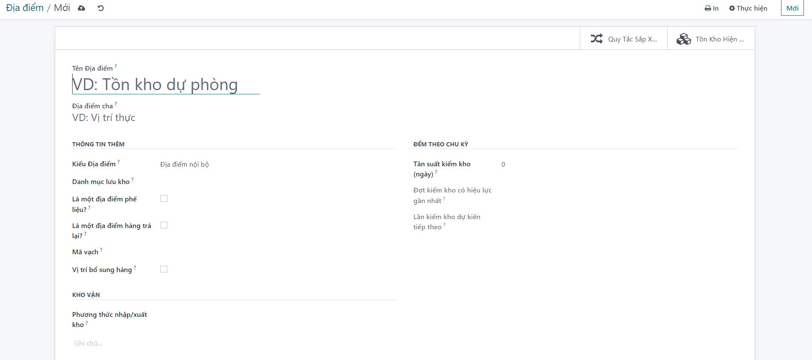
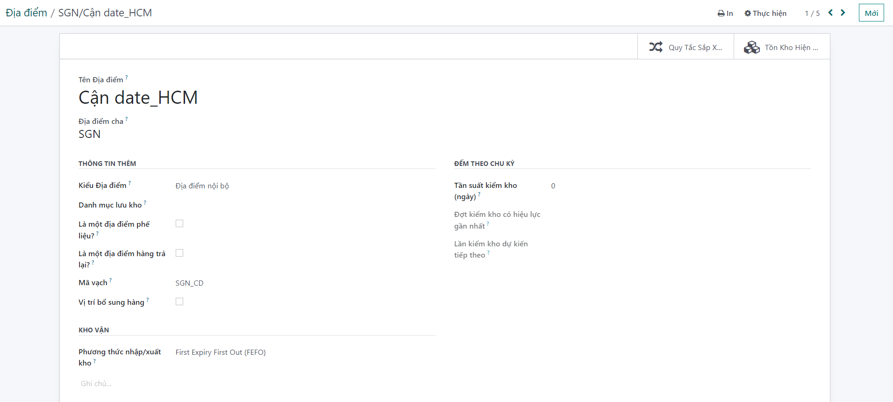

# Tạo địa điểm cận date
Địa điểm lưu trữ các sản phẩm cận date


**Bước 1:** vào  ```Kho vận >>  Quản lý kho>>Địa điểm ``` 


**Bước 2:** Để tạo một địa điểm mới, người dùng kích nút ``` TẠO``` , màn hình tạo mới được hiển thị.




**Bước 4:** tạo địa điểm cận date HCM. Nhập thông tin cần khai báo


+ Địa điểm cha: SGN
+ Mã vạch
+ Phương thức nhập/xuất kho: FEFO
+ View user: múc đích show thông tin địa điểm này ở các menu như Địa điểm, chuyển đổi lô, dịch chuyển địa điểm

**Bước 5:** Người dùng kích nút LƯU để Lưu thông tin cấu hình

