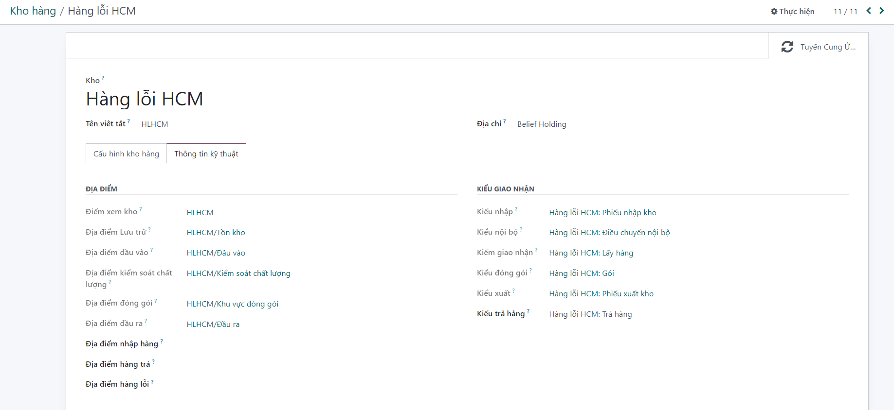

# Tạo kho hàng lỗi

**Bước 1:** tạo kho hàng lỗi Hồ Chí Minh  ```Kho vận >> Quản lý kho hàng >> Kho hàng```


**Bước 2:** Người dùng kích nút ```TẠO```, màn hình tạo mới sẽ được hiển thị


**Bước 3:** Khai báo kho hàng lỗi


**Bước 4:**  ```Kho vận >> Quản lý kho hàng >> Kho hàng>> Cấu hình kho hàng```

**Nhập các thông tin khởi tạo kho:**

+ Tên kho.

+ Tên viết tắt.

+ Chọn hoặc tạo mới địa chỉ cho kho.

+ Thông tin Cấu hình kho hàng: chọn phương thức nhập và xuất hàng của kho. Hệ thống cho phép người dùng có thể lựa chọn một trong các phương thức nhận/xuất hàng 1 bước, 2 bước hoặc 3 bước, đáp ứng được nhu cầu hoạt động khác nhau của các kho.
    + Lô hàng nhận: Nhận hàng trực tiếp (1 bước)
    + Xuất hàng đi?: Đóng gói, xuất hàng và giao hàng (3 bước)
    + Mua để tái cung ứng?: tích chọn


```Kho vận >> Quản lý kho hàng >> Kho hàng>> Thông tin kỹ thuật```
Chứa thông tin về các địa điểm của kho đang khởi tạo. Các địa điểm này sẽ được tự động sinh ra khi kho được khởi tạo thành công
 
Ghi chú: Kiểm tra lại cấu hình các picking type (Kiểu giao nhận)


Vào ```Kho hàng >> Hàng lỗi HCM >>Hàng lỗi HCM: Phiếu nhập kho>> Hàng lỗi HCM: Phiếu xuất kho``` để check thông tin phiếu xuất kho


**Bước 5:** Người dùng kích nút LƯU để Lưu thông tin cấu hình

