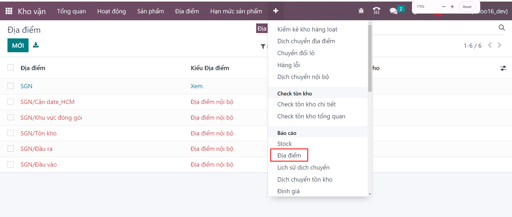
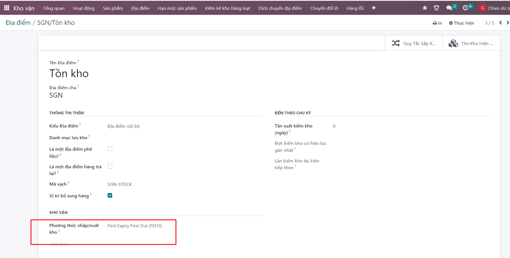

# Cấu hình FEFO cho kho mới tạo 

**Chọn fefo cho địa điểm cha SGN/tồn kho hoặc SGN/stock**

**Bước 1:** ```Kho vận >>  Quản lý kho>>Địa điểm ``` 



**Bước 2:** Kích vào một bản ghi để xem thông tin của một địa điểm.


**Bước 3:** Chọn phương thức nhập xuất cho kho: FEFO



**Bước 4:** Người dùng kích nút LƯU để Lưu thông tin cấu hình


