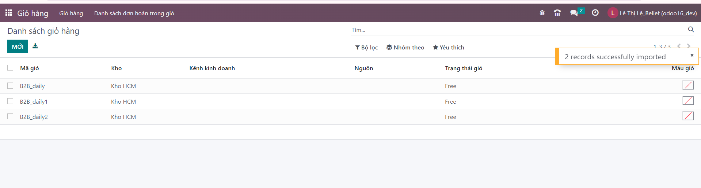

# Tạo giỏ hàng
Chức năng này dành cho người quản lý có quyền quản lý giỏ, khai báo thông tin giỏ


**Bước 1:** ```Menu>>Giỏ hàng>Mới```


**Bước 2:** Khai báo thông tin giỏ
+ Mã giỏ: là duy nhất (không được trùng với kho khác)
+ Kho: Kho mặc định theo user


**Bước 3:**Người dùng kích nút LƯU để Lưu thông tin cấu hình

# Import tạo giỏ hàng
Chức năng này dành cho người quản lý có quyền quản lý giỏ, khai báo thông tin nhiều giỏ cùng lúc
**Bước 1:** tại màn hình danh sách giỏ: ```Import dữ liệu```. 

**Bước 2:**  Chọn nút ```Tải tệp lên```. 


**Bước 3:** Chuẩn bị excel danh sách giỏ như mẫu, import lên


**Bước 4:** Chọn nút ```Nhập```. 


**Bước 5:** Import thành công danh sách giỏ hàng
