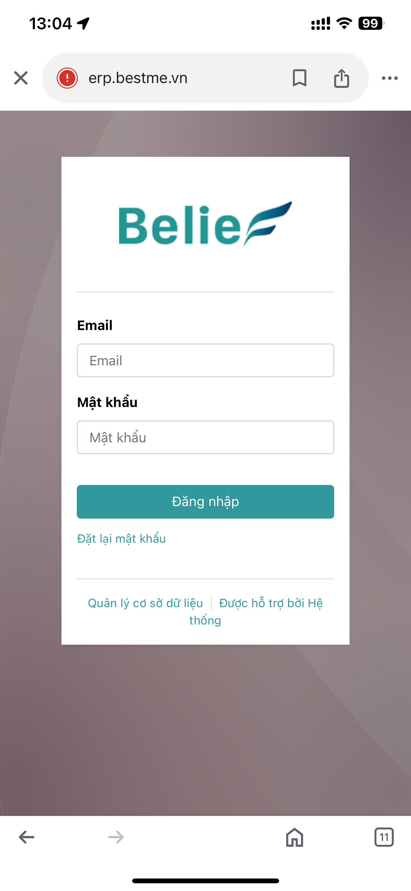
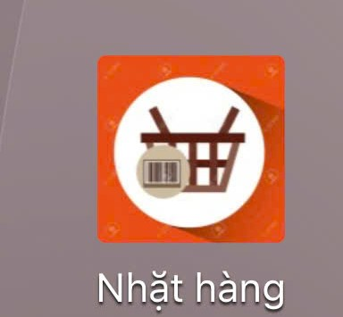
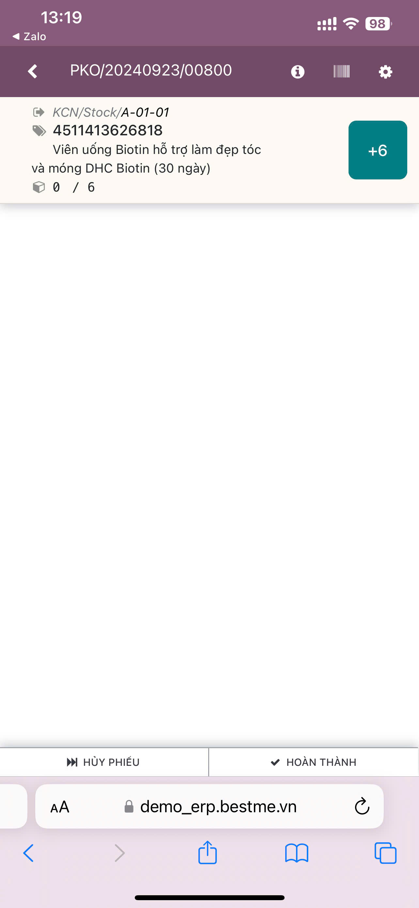

# Quy trình nhặt hàng 
## Nhặt hàng bằng điện thoại 
**Bước 1:** truy cập vào đường dẫn ```https://erp.bestme.vn/``` Vào menu ```nhặt hàng/ quét giỏ```

Đăng nhập hệ thống bằng tài khoản đã được cấp với quyền pick/pack


Vào menu ```Nhặt hàng```
Cầm giỏ free quét mã vạch




**Bước 2:** Quét sản phẩm bỏ vào giỏ
+ Trường người nhặt hàng quét mã giỏ thành công hiển thị màn hình danh sách sản phẩm cần nhặt




+ Quét sản phẩm để nhặt hàng (mục đích việc này để nhặt đúng đủ số lượng)
    + Quét QR code từng sản phẩm để tăng số lượng đã nhặt đến lúc nhặt đủ
    + Bấm ```+n```n: là số nguyên dương.Ở bên phải để tăng đủ số lượng 


**Bước 3:** Hoàn thành nhặt phiếu

Người dùng hoàn thành nhặt phiếu : chọn nút [Hoàn thành]. Hoàn thành việc nhặt hàng

Thực hiện quét tiếp giỏ hàng để nhặt cho giỏ mới


## Nhặt hàng bằng máy quét liên kết với máy tính PC

**Bước 1:** truy cập vào đường dẫn ```https://erp.bestme.vn/``` Vào menu ```nhặt hàng/ quét giỏ```

Cầm giỏ free quét mã vạch


+ Trường người nhặt hàng không có phiếu nhặt hàng nào được gắn với họ hoặc giỏ đang không free thì sẽ hiển thị cảnh báo


**Bước 2:** Quét sản phẩm bỏ vào giỏ
+ Trường người nhặt hàng quét mã giỏ thành công hiển thị màn hình danh sách sản phẩm cần nhặt


+ Quét sản phẩm để nhặt hàng (mục đích việc này để nhặt đúng đủ số lượng)
    + Quét QR code từng sản phẩm để tăng số lượng đã nhặt đến lúc nhặt đủ
    + Bấm ```+n```n: là số nguyên dương.Ở bên phải để tăng đủ số lượng 


+  Quét sản phẩm để nhặt hàng (mục đích việc này để nhặt đúng đủ số lượng):khi đủ số lượng nhặt sẽ hiển thị màu xanh ở các sản phẩm đủ hàng nhặt rồi


```Hủy phiếu``` thì danh sách đơn này được bỏ ra khỏi phiếu . Tạo lại phiếu pick khác

**Bước 3:** Hoàn thành nhặt phiếu

Người dùng hoàn thành nhặt phiếu : chọn nút [Hoàn thành]. Hoàn thành việc nhặt hàng

Thực hiện quét tiếp giỏ hàng để nhặt cho giỏ mới

