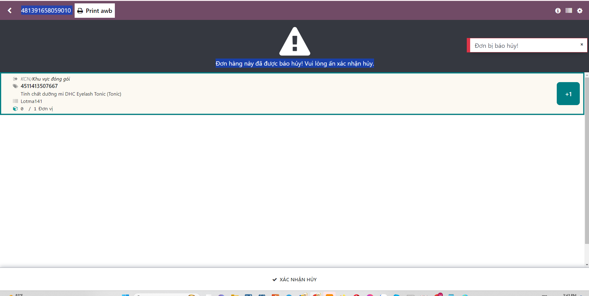

# Đóng hàng

Chức năng này sau khi có giỏ hàng nhặt thì người đóng gói thực hiện đóng gói đơn hàng

**Bước 1:** Quét giỏ hàng để đóng gói

**Bước 2:** Hiển thị thông tin phiếu đóng hàng

**Bước 3:** Hiển thị thông tin phiếu đóng hàng

**Bước 4:** Nhấn nút scan barcode

Tự động sinh ra một mã đơn bất kỳ, tự động in ra phiếu vận chuyển

**Bước 5:** Quét sản phẩm để hoàn thành đóng gói đơn hàng

**Bước 6:** Quét sản phẩm để đóng gói

+ Hoàn thành sản phẩm, tự động show đơn mới để đóng gói

+ Bỏ qua lượt, để đóng cuối cùng. 

**Bước 7:**  Trường hợp trong quá trình đóng gói mà đơn bị huỷe sẽ hiển thị màn hình xác nhận hủy và để tiếp tục đóng gói đơn hàng khác

**Bước 8:**  Hoàn thành đóng gói

