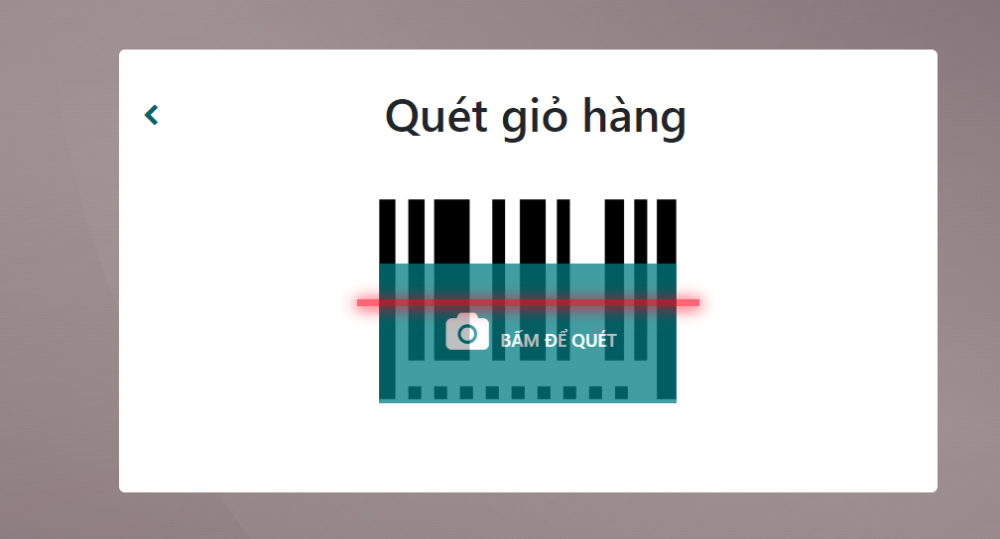
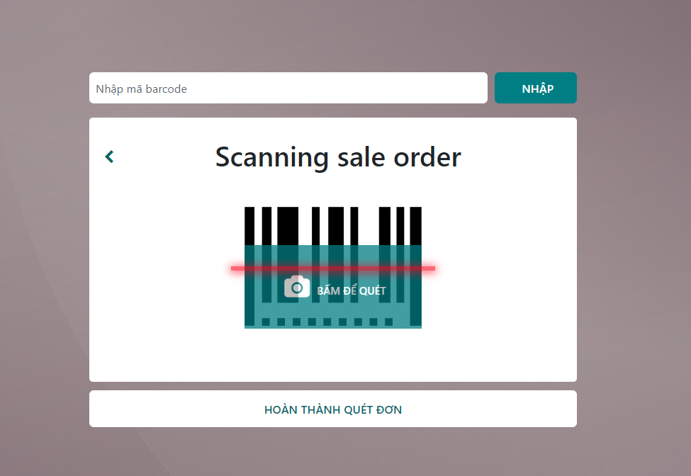

# Hoàn hàng
Chức năng này mục đích hoàn hàng đã bán mà trả về kho

**Bước 1:** ```Menu>> Quét mã giỏ```


**Bước 2:** Quét giỏ hàng


**Bước 3:** Sau khi quét giỏ hàng, hiển thị màn hình thông tin giỏ hàng. Bấm nút ```Scan nhặt đơn hoàn```


**Bước 4:** hiển thị màn hình nhập hoặc scan đơn hàng
    TH1: Đơn hoàn về có mã vạch người dùng scan để thực hiện đơn hoàn
    TH2: Đơn hoàn về không có mã vạch thì nhập mã đơn hàng bấm nút ```Nhập```

**Bước 5** Hiển thị màn hình danh sách sản phẩm trong đơn
+ Quét sản phẩm để hoàn


**Bước 6** Bấm vào nút hoàn thành toàn bộ, hoặc hoàn thành 1 phần (nếu chỉ có hoàn 1 phần sản phẩm trong đơn hàng). Khi đó hiển thị màn hình scan đơn hoàn tiếp theo. Trường hợp không còn đơn hoàn thì sẽ nhấn nút ```Hoàn thành quét đơn```.
Phiếu được chuyển về trạng thái ```Hoàn thành nhặt đơn```


