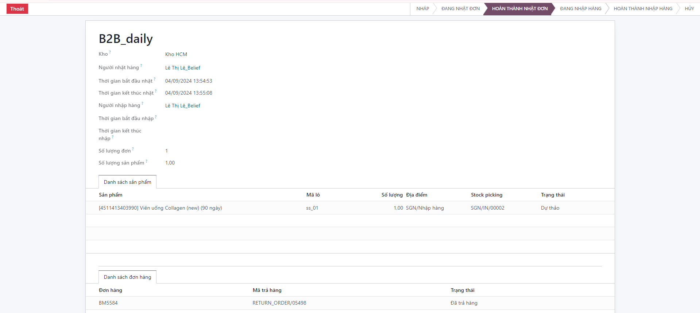
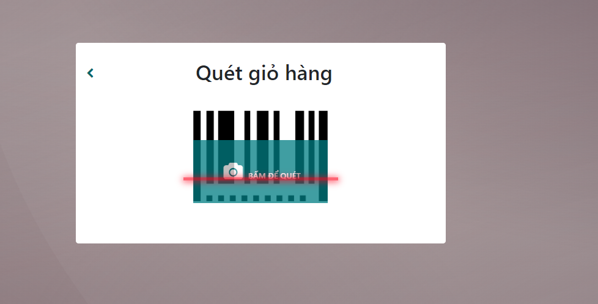

# Cất hàng vào địa điểm
Chức năng này mục đích cất hàng vào địa điểm trong kho
Điều kiện: Hoàn thành nhặt đơn

**Bước 1:** Quét giỏ hàng đã hoàn thành nhặt đơn

**Bước 2:** Hiển thị danh sách sản phẩm cần cất hàng

**Bước 3:** Thông tin chi tiết sản phẩm cần cất gồm:
    + Tên sản phẩm
    + SKU
    + Địa điểm gợi í
    + Số lượng

**Bước 4:** Click hoàn thành cất sản phẩm

**Bước 5:** Sau khi cất hết sản phẩm thì hoàn thành thành ```Hoàn thành toàn bộ```


**Bước 6:** ```Hoàn thành việc cất hàng```

**Bước 7:**

