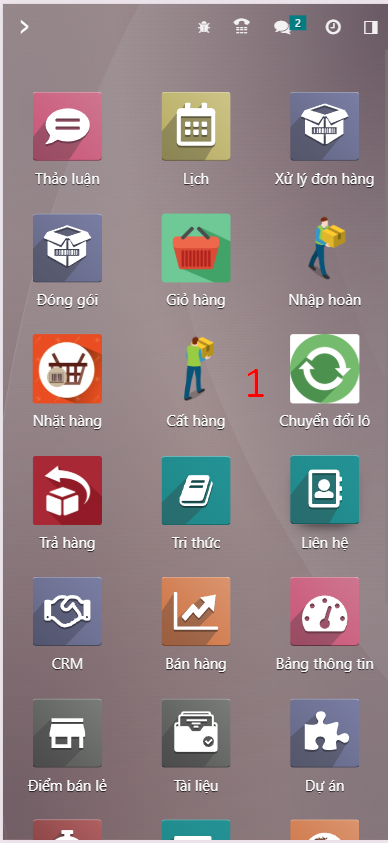
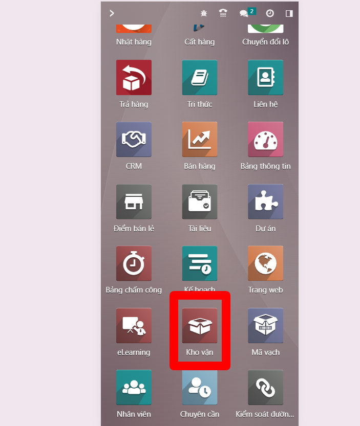
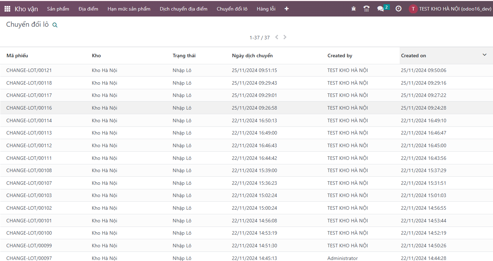

# Chuyển đổi lô
**Bước 1:** ```Menu>>Chuyển đổi lô```


**Bước 2:** ```Quét địa điểm```


**Bước 3:** Hiển thị màn hình bao gồm các thông tin về mã phiếu, kho, vị trí
Nhấn nút ```Thêm sản phẩm```


**Bước 4:** ```Quét sản phẩm```


**Bước 5:** ```Quét lô đúng```. Không quét các sản phẩm đã có lô hết hạn


**Bước 6:** ```Nhập số lượng cần chuyển đổi``` nhập số nguyên dương <=Số lượng tối đa


# Xem danh sách đã chuyển đổi lô
**Bước 1:** ```Vào menu kho vận```



**Bước 2:** ```Chọn chuyển đổi lô```


**Bước 3:** ```Xem các thông tin trong phiếu chuyển đổi```


