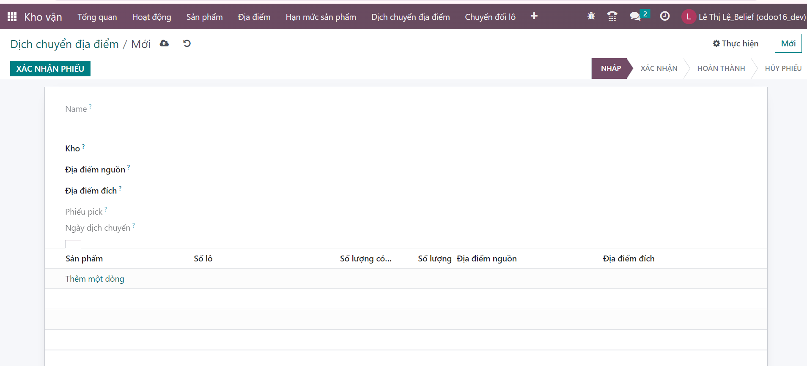

# Dịch chuyển địa điểm
## Dịch chuyển địa điểm trên máy tính PC
Chức năng này dành cho nhân viên kho vận dịch chuyển địa điểm các sản phẩm trong kho

**Bước 1:**  ```Menu>>Kho vận>> Dịch chuyển địa điểm```


**Bước 2:** Nhấn vào menu ```Mới``` hiển thị màn hình thêm mới dịch chuyển địa điểm


**Bước 3:** Nhập thông tin dịch chuyển
+ Kho
+ Địa điểm nguồn
+ Địa điểm đích
+ Thông tin sản phẩm, số lô, số lượng có thể dịch chuyển, số lượng địa điểm nguồn, địa điểm đích.




**Bước 4:** Người dùng kích nút LƯU để Lưu thông tin cấu hình

# 2. Import dịch chuyển địa điểm

Để dịch chuyển nhiều vị trí cùng 1 lúc, nhân viên kho có thể thực hiện tính năng dịch chuyển địa điểm

**Bước 1:** (1) tải danh sách phiếu dịch chuyển. (2) Thực hiện import địa điểm


**Bước 2:** Dùng mẫu file để import lên


**Bước 3:** Tải file lên import thành công

## Dịch chuyển địa điểm trên điện thoại

**Bước 1:**  ```Menu>>Kho vận>> Dịch chuyển địa điểm```


**Bước 2:** Tạo phiếu như phần bước 2 ở trên pc
<a href=" https://le-leeeeeee123.github.io/tai-lieu-odoo/docs/Dichchuyendiadiem.html">Thêm mới phiếu dịch chuyển</a>