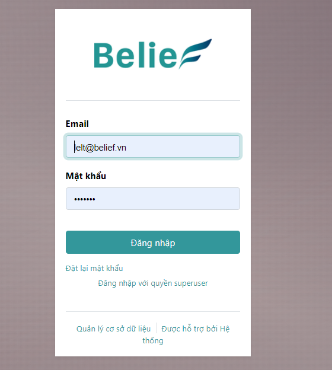
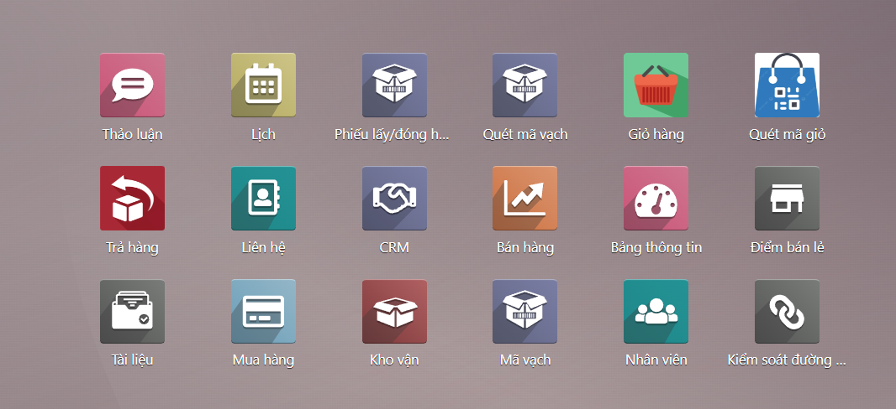
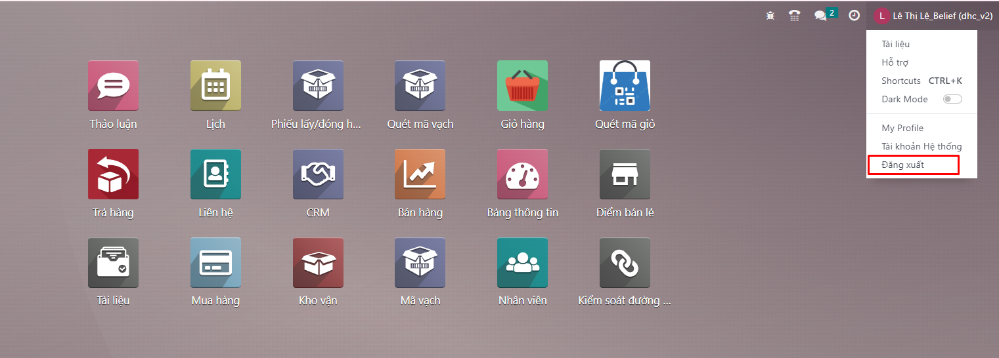

# Đăng nhập
Sau khi đã có đường link của hệ thống https://erp.bestme.vn, người dùng có thể đăng nhập vào hệ thống bằng thông tin tài khoản được cung cấp bằng cách:

**Bước 1:** Truy cập trang web hệ thống qua đường link trong mail đã đăng ký.

**Bước 2:** Hệ thống mở màn hình đăng nhập cho phép người dùng nhập thông tin tài khoản.

**Bước 3:** Người dùng nhập các thông tin Tên đăng nhập/Email và Mật khẩu bằng tài khoản đã được cung cấp qua email và kích Đăng nhập để đăng nhập vào hệ thống.Sau khi đăng nhập thành công, hệ thống mở màn hình chính chứa các module mà người dùng đã được phân quyền truy cập như ví dụ hình dưới:

 

# 2. Đăng xuất

Để đăng xuất, người dùng thao tác như sau:
Tại màn hình chính của hệ thống (hoặc có thể thao tác tạo tất cả màn hình khác), người dùng kích vào tên tài khoản tại góc trên bên phải và kích chọn Đăng xuất.

Sau khi đăng xuất thành công, hệ thống quay trở lại màn hình đăng nhập.

