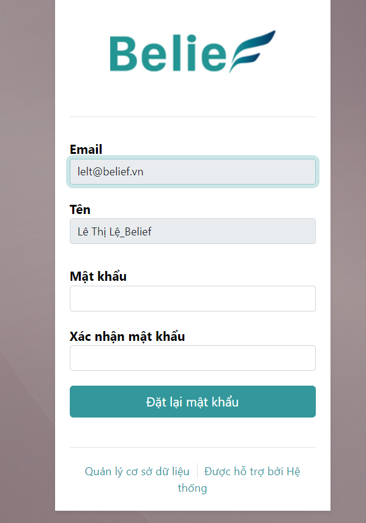

# Quên mật khẩu

Trường hợp người dùng quên mật khẩu, hệ thống cho phép người dùng lấy lại mật khẩu của tài khoản của mình qua thao tác như sau:

**Bước 1:** Tại màn hình đăng nhập nhấn vào ```[Đặt lại mật khẩu].```


**Bước 2:** Hiển thị màn hình nhập email đăng nhập nhấn nút```[Đặt lại mật khẩu].```


**Bước 3:** Hiển thị thông báo đặt lại mật khẩu đã được gửi vào  ```Email```


**Bước 4:** Người dùng vào email để đọc email nhấn nút ```Change password```


**Bước 5:** Hiển thị màn hình đặt lại mật khẩu, nhập mật khẩu và xác nhận mật khẩu sau đó nhấn nút ```[Đặt lại mật khẩu].``` và đồng thời đăng nhập thành công với mật khẩu vừa thay đổi




