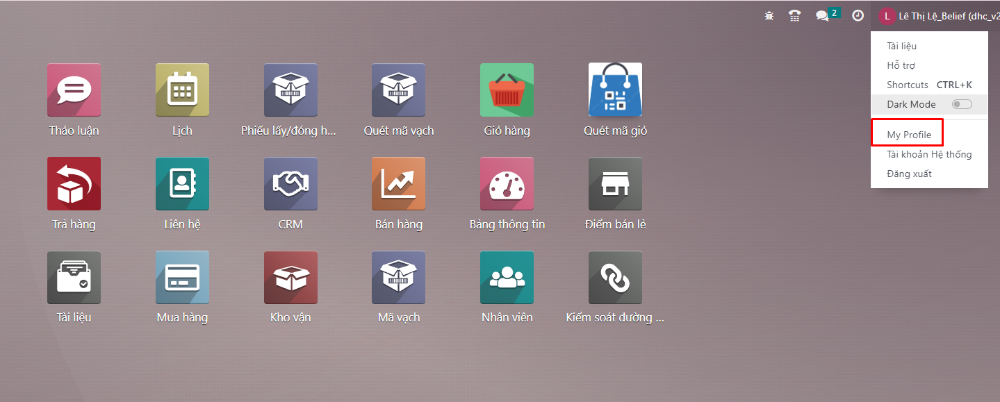
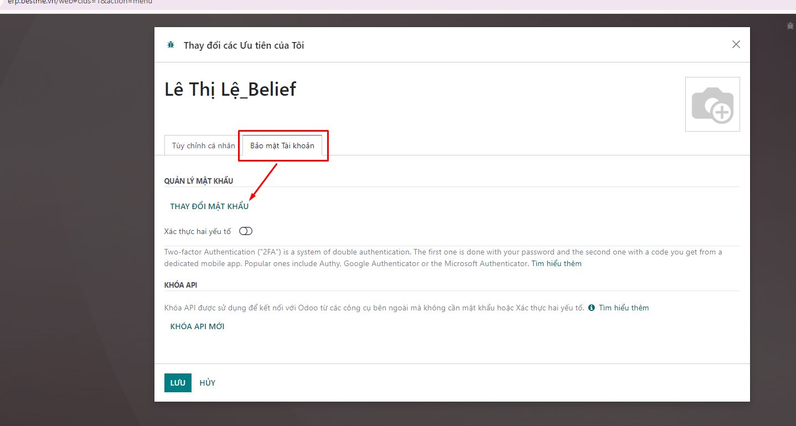
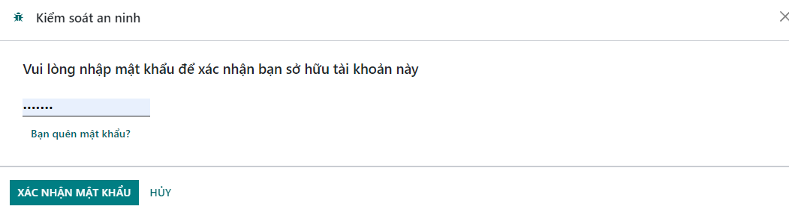
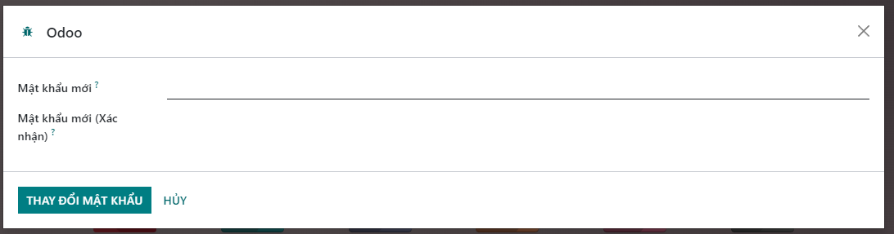

# Thay đổi mật khẩu người dùng
Để bảo mật thông tin tài khoản, hệ thống cho phép người dùng đổi mật khẩu của tài khoản của mình qua thao tác như sau:

**Bước 1:** Tại màn hình chính của hệ thống (hoặc có thể thao tác tạo tất cả màn hình khác), người dùng kích vào tên tài khoản tại góc trên bên phải và kích chọn vào menu ```[My profile].```


**Bước 2:** Hệ thống mở màn hình thông tin cá nhân của tài khoản đang đăng nhập. Để mở màn hình đổi mật khẩu, người dùng kích vào ```[Bảo mật tài khoản]/[Đổi mật khẩu].```



**Bước 3:** Tại màn hình đổi mật khẩu, người dùng nhập các thông tin: mật khẩu cũ, mật khẩu mới, xác nhận mật khẩu mới. Sau đó kích tiếp vào nút ĐỔI MẬT KHẨU để xác nhận thao tác đổi mật khẩu.




**Bước 4:** Sau khi đổi mật khẩu thành công, hệ thống tự động đăng xuất tài khoản đang đăng nhập và người dùng cần thao tác đăng nhập lại bằng mật khẩu mới vừa đổi.
