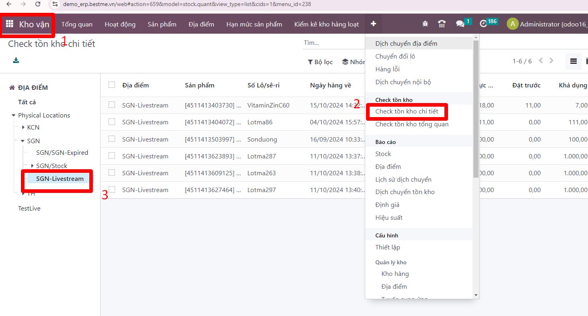
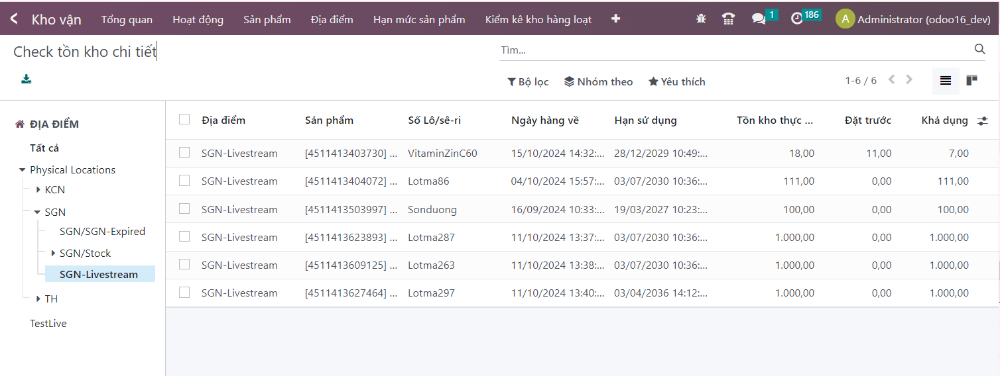
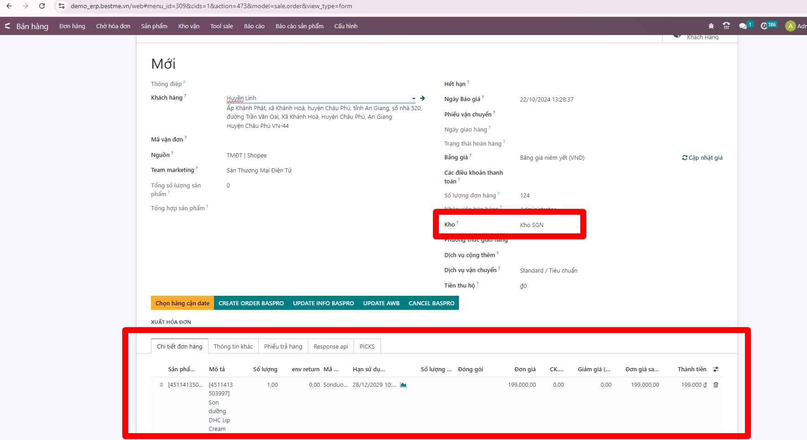
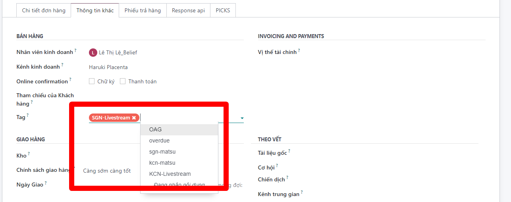

# Bán hàng theo địa điểm
**Mục đích:** giúp bên bán hàng lên đơn hàng trong các địa điểm đã khởi tạo.

**Gồm các địa điểm:**  
* Đối với kho hà nội 2 địa điểm mới trong kho Hà Nội là ``kcn-matsu`` ( dành cho Matsumoto Kiyoshi ) và địa điểm ``KCN-Livestream`` cho team ecom.

* Đối với kho SGN 2 địa điểm mới trong kho SGN là ``sgn-matsu`` ( dành cho Matsumoto Kiyoshi ) và địa điểm ``SGN-Livestream`` cho team ecom.

Ví dụ với kho ``SGN-Livestream``
**Bước 1**: Người bán check tồn kho sản phẩm của địa điểm  ``SGN-Livestream``

**Bước 2** Lên đơn bán hàng với địa điểm ``SGN-Livestream``
Thông tin kho, thông tin sản phẩm bán

**(Lưu ý: Chọn tag= địa điểm bán)**: Nếu không chọn sẽ không nhận diện được địa điểm. Bắt buộc chọn và chỉ được chọn một 

**Bước 3** Xác nhận đơn thành công thông tin đơn hàng sẽ được lấy tồn từ các địa điểm bán được chỉ định trong đơn

**Tương tự: lên đơn với các điểm điểm matsu**