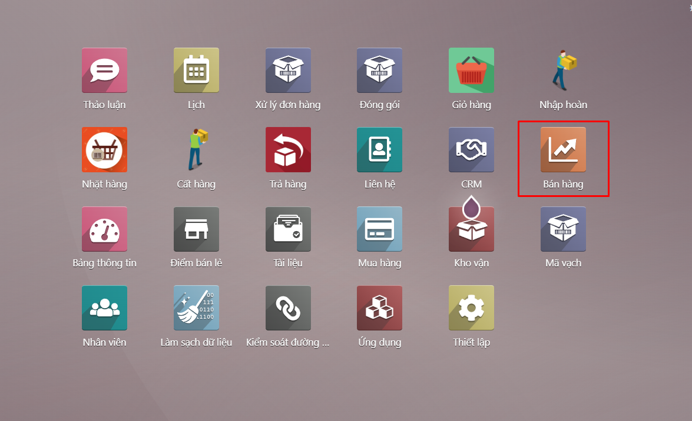
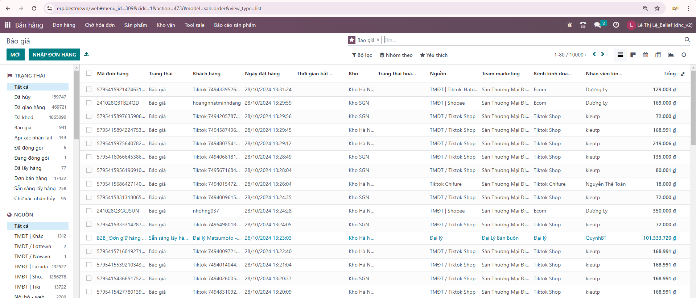
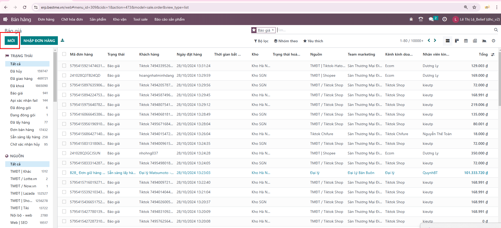
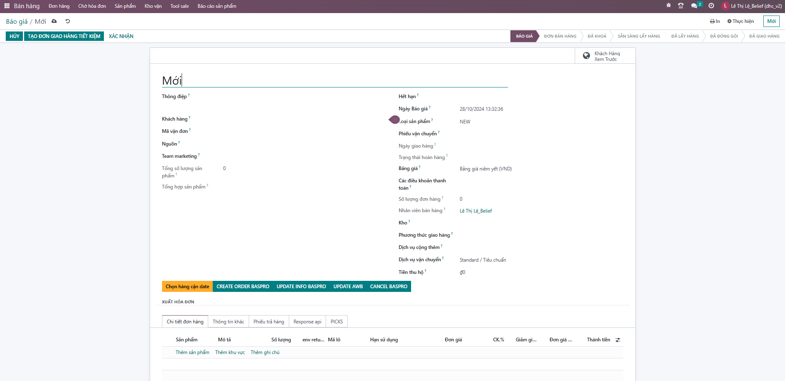
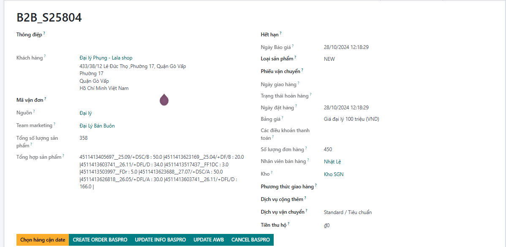
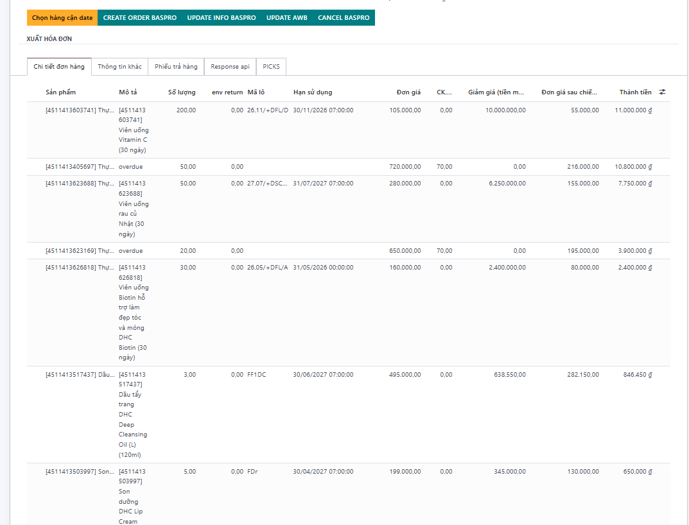
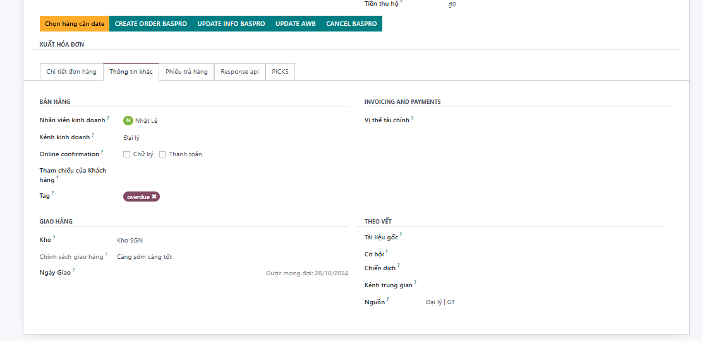

# Bán hàng với đơn cận date
**Bước 1:** Người dùng đăng nhập hệ thống https://erp.bestme.vn/ --> Chọn bán hàng


**Bước 2:** Thêm mới một đơn bán hàng



**Bước 3:** Ví dụ thêm mới một đơn bán hàng như sau:


```Lưu ý 1: Chọn tag overdue và phần mô tả sản phẩm của các line cận date ghi overdue vào (bắt buộc), lưu ý không chọn lô cho các sản phẩm cận date```

```Lưu ý 2 : Chọn tag=overdue```

```Lưu ý 3: Một đơn bán hàng không thể lên đơn vừa là địa điểm chỉ định ví dụ như địa điểm matsu vừa là overdue được, cũng như phần tag chỉ được chọn 1 overdue hoặc matsu```





