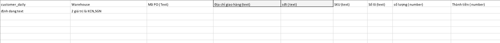
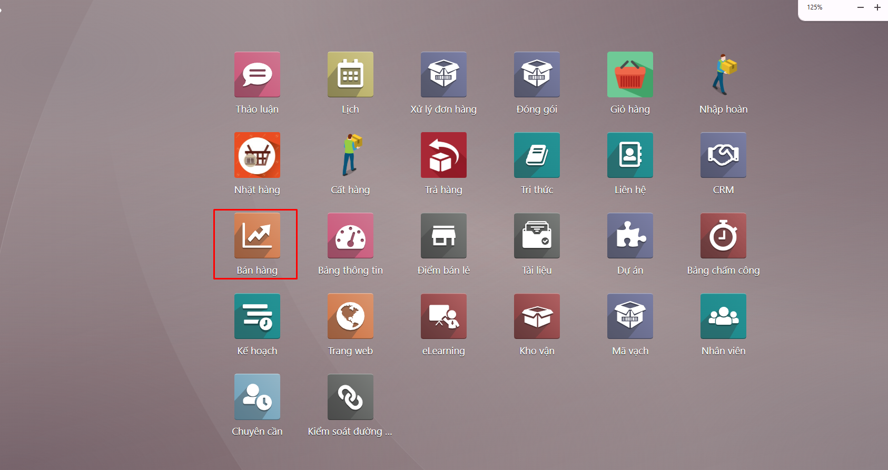
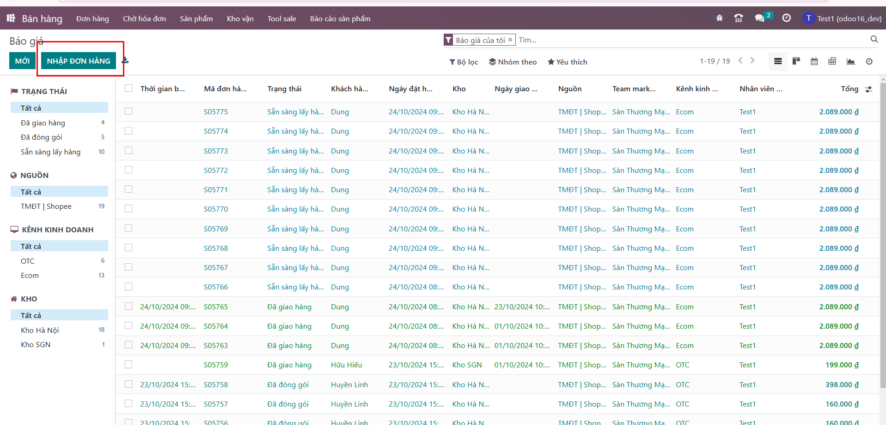
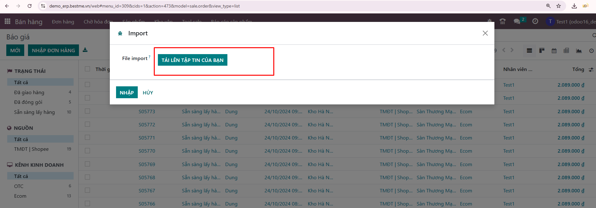

# Import đơn hàng đại lý
1. Mẫu import gồm các thông tin sau

**Bước 1:** Người dùng đăng nhập hệ thống https://erp.bestme.vn/ . Chọn nút ```Nhập đơn hàng```


**Bước 2:** Thực hiện import file

File data mẫu như sau:
<a href="https://docs.google.com/spreadsheets/d/1KbLz2lfgrFpJ-oClp1BeTjY4LrR7ntgw/edit?usp=sharing&ouid=108648371589983090109&rtpof=true&sd=true">34 đơn collagen</a>

**Bước 3:** Import thành công hiển thị các đơn đã import ở danh sách đơn hàng

Lưu ý: customer_daily sẽ lấy ở Liên hệ/Tên đại lý/Bán hàng và mua hàng/ID Công ty?