# Quản lý đơn hàng
Chức năng này giúp người dùng quản lý hoạt động bán hàng trên hệ thống, từ đó có thể quản lý được các đơn hàng, doanh thu và khách hàng của doanh nghiệp. Từ đó đưa ra các chính sách bán hàng hợp lý. Để tạo đơn hàng, người dùng thực hiện các thao tác sau:

**Bước 1:** Người dùng chọn menu ```Bán hàng >> Mới để mở màn hình đơn hàng.```

![alt text]./banhang/image.png)
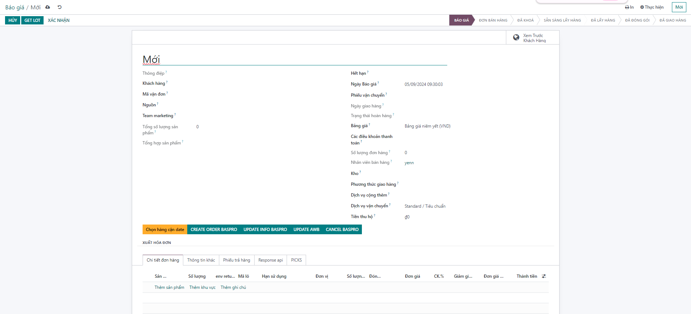

**Bước 2:** Nhập các thông tin của đơn hàng:
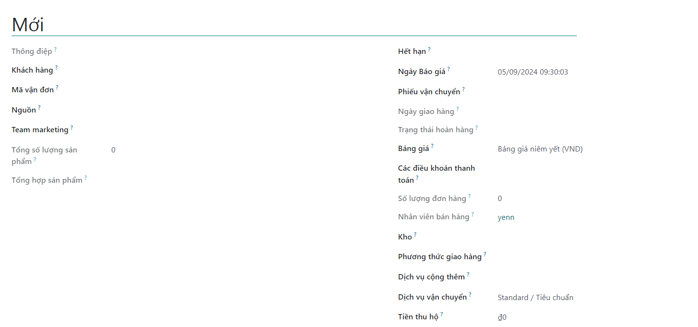
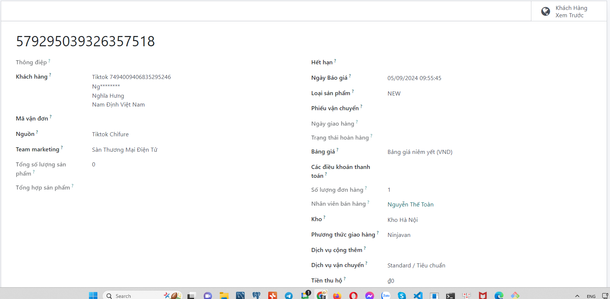

+ Thông điệp?: hiển thị thông điệp nếu có của đơn hàng, ví dụ: 
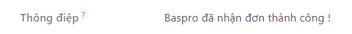
+ Khách hàng: thông tin khách hàng đặt hàng, số điện thoại + địa chỉ: ex
Tiktok 7494009406835295246
Ng********
Nghĩa Hưng
Nam Định Việt Nam

+ Mã vận đơn: nhập mã vận đơn (nếu có)
+ Nguồn: chọn nguồn cho đơn hàng: ex
Tiktok Chifure
Team marketing?
Sàn Thương Mại Điện Tử
+ Tổng số lượng sản phẩm
+ Tổng hợp sản phẩm
+ Hết hạn:
+ Ngày Báo giá: ngày lên đơn báo giá: ex
05/09/2024 09:55:45
+ Loại sản phẩm: NEW
+ Phiếu vận chuyển
+ Ngày giao hàng
+ Trạng thái hoàn hàng
+ Bảng giá
+ Bảng giá niêm yết (VND)
+ Các điều khoản thanh toán:
+ Số lượng đơn hàng = 1
+ Nhân viên bán hàng: ex Nguyễn Thế Toàn
+ Kho:Kho Hà Nội
+ Phương thức giao hàng:Ninjavan
+ Dịch vụ cộng thêm?
+ Dịch vụ vận chuyển?
Standard / Tiêu chuẩn
Tiền thu hộ?₫
...


**Mục Chi tiết đơn hàng: kích Thêm sản phẩm để thêm các sản phẩm muốn bán cho khách hàng.**

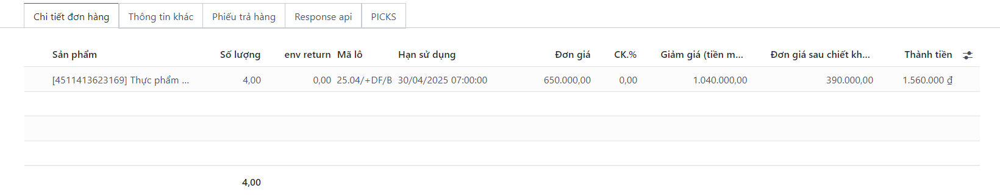


Lưu ý: Tại màn hình bán hàng, người dùng có thể check luôn được số lượng tồn kho của sản phẩm đang được chọn bán bằng cách kích vào biểu tượng  bên cạnh cột ```Đơn vị```.

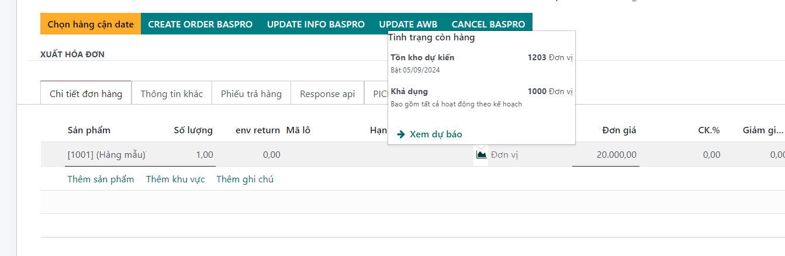

+ Nếu 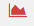 có màu đỏ có nghĩa là tồn kho sản phẩm không đủ để đáp ứng số lượng bán.


+ Nếu 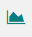 có màu xanh có nghĩa là tồn kho sản phẩm đủ để đáp ứng số lượng bán.


+ Mục Sản phẩm tùy chọn: Kích Thêm một dòng để thêm các sản phẩm tùy chọn (gợi ý bán) cho khách hàng. Các sản phẩm này chỉ mang tính chất tham khảo cho khách hàng, không tính vào giá trị của đơn hàng.


+ Mục Thông tin khác: chứa các thông tin về nhóm bán hàng, nhân viên chăm sóc, thông tin lên hóa đơn, giao hàng (kho xuất hàng, ngày giao, chính sách giao hàng) hay các thông tin tham chiếu khác liên quan (chiến dịch, kênh, nguồn,…).


**Bước 3:** Kích Lưu để lưu đơn hàng trạng thái Báo giá.
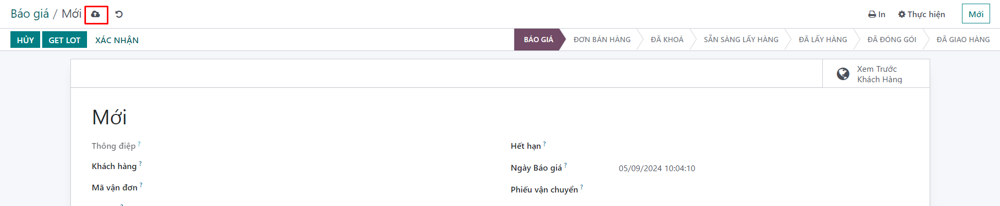

**Bước 4:** ```Xác nhận``` đơn hàng, xác nhận đơn bán . Trạng thái đơn chuyển thành: ```Sẵn sàng lấy hàng``` khi đó đơn sẽ hiển thị thông tin  số lượng sản phẩm, và số lô của sản phẩm
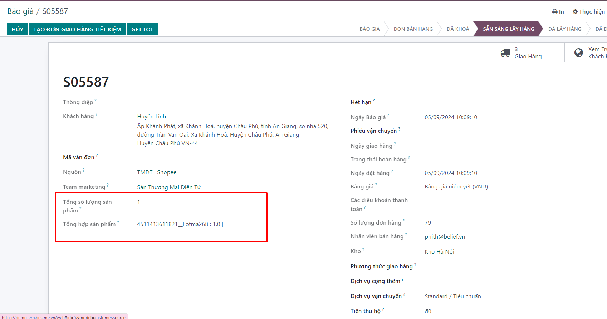

**Bước 5:** Tạo hóa đơn công nợ:

+ Vào phần giao hàng

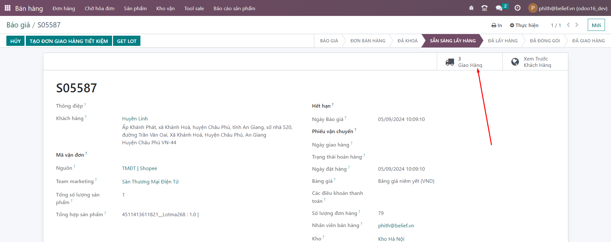
+ Chọn xem các phiếu pick. thông tin phiếu, chi tiết phiếu
+ Tại phiếu giao hàng: kích nút Kiểm tra khả dụng để kiểm tra xem tại kho đang chọn có đủ hàng để xuất cho khách hàng hay không. Nếu không đủ tồn, phiếu kho vẫn ở trạng thái Chờ. Nếu đủ, phiếu kho sẽ chuyển sang trạng thái Sẵn sàng và các sản phẩm đủ điều kiện xuất đi sẽ được hiển thị tại mục chi tiết như hình.

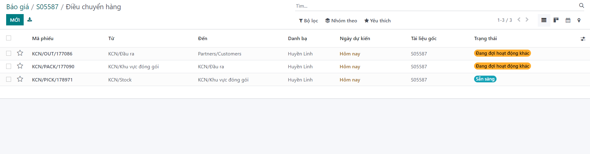

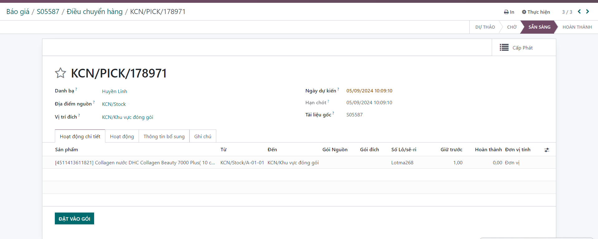

 