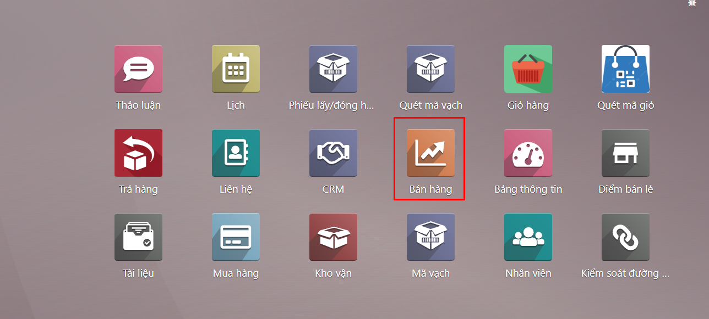
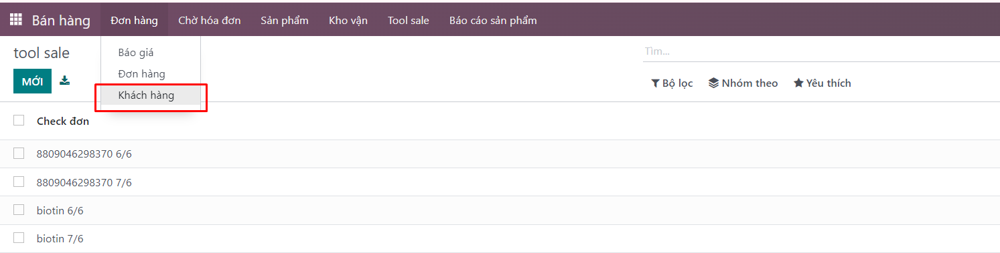
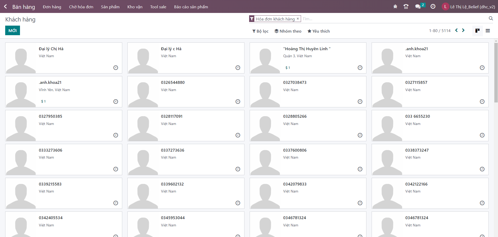
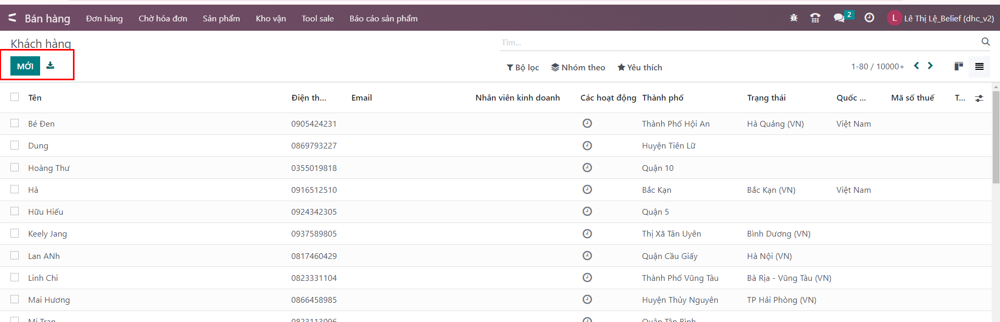
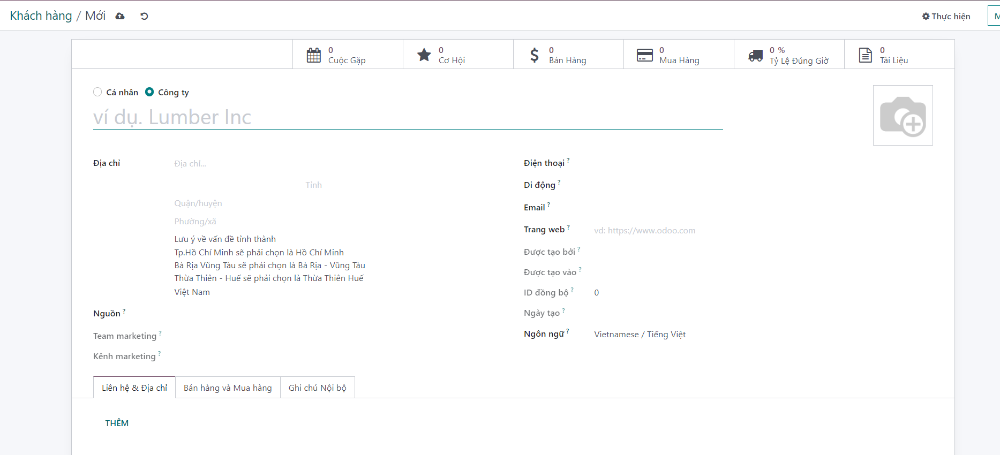
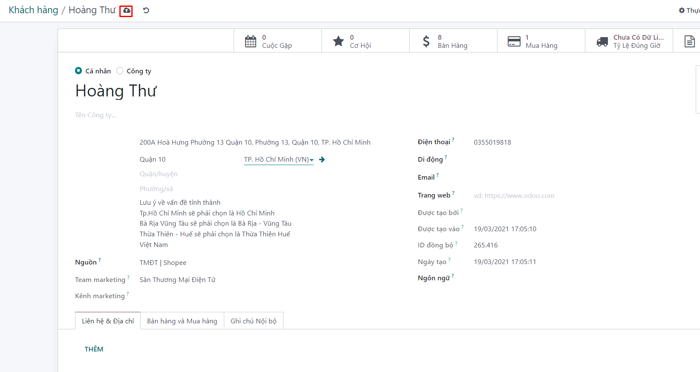

# Quản lý khách hàng

Chức năng này giúp người dùng quản lý được thông tin KH, từ đó đưa ra các chính sách bán hàng hợp lý. Để xem thông tin KH, người dùng thao tác như sau:

**Bước 1:** Người dùng chọn menu ```Bán hàng >> Đơn hàng >> Khách hàng >>``` Chọn 1 KH để xem thông tin.




Tại đây người dùng có thể kiểm tra được các thông tin xoay quanh khách hàng:


+ Danh sách khách hàng

+ Bên cạnh đó, người dùng cũng có thể xem được thông tin như SĐT, địa chỉ,… của KH.

**Bước 2:** Kích nút Tạo để mở màn hình tạo mới khách hàng:



**Bước 3:** Nhập các thông tin của khách hàng: tên, mã, địa chỉ, mã số thuế, số điện thoại, email,…



+ Các liên hệ và địa chỉ: Kích vào nút Thêm để mở màn hình tạo các liên hệ, địa chỉ xuất hóa đơn, địa chỉ giao hàng, địa chỉ khác hay địa chỉ cá nhân liên quan đến khách hàng. Một khách hàng có thể có nhiều liên hệ hay địa chỉ liên quan.

+ Bán và mua: chứa các thông tin liên quan đến hoạt động mua và bán liên quan đến khách hàng như nhóm khách hàng, thông tin chăm sóc khi mua hàng, thông tin điều khoản mua hàng (nếu cũng là nhà cung cấp), vị thế tài chính,…

+ Ghi chú nội bộ: thêm các ghi chú liên quan đến khách hàng (nếu có).

**Bước 4:** Kích nút Lưu để lưu khách hàng vừa tạo. Lưu thành công hiển thị màn hình danh sách
