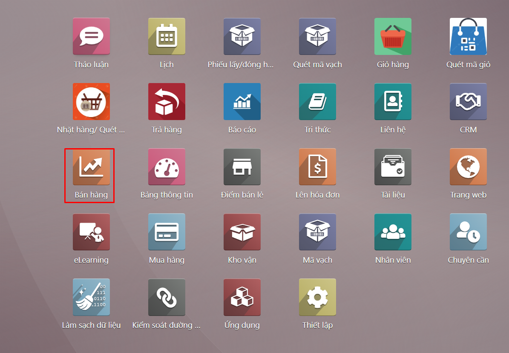
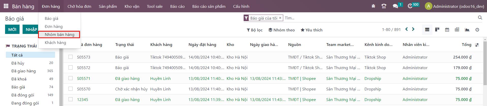
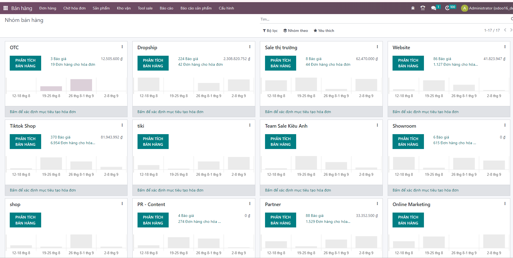

# Quản lý nhóm bán hàng (Kênh bán hàng)
Chức năng này giúp người dùng quản lý các kênh bán hàng của doanh nghiệp và các thành viên trong nhóm bán hàng. Để kiểm tra thông tin của nhóm bán hàng, người dùng thực hiện các thao tác sau:

Người dùng chọn menu ```Bán hàng >> Đơn hàng >> Nhóm bán hàng.```



Tại đây người dùng có thể kiểm tra xem nhóm bán hàng có bao nhiêu cơ hội, bao nhiêu đơn hàng và trạng thái của các đơn hàng.

​

Người dùng kích tại đây để xem các thông tin khác như tiềm năng, cơ hội, đơn bán hàng,…

​​​​

