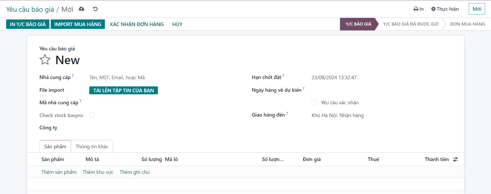
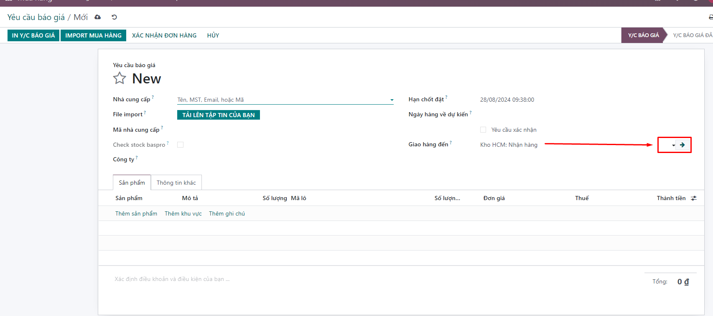

# Mua hàng
**1. Tạo phiếu mua hàng**
Chức năng này giúp người dùng tạo các phiếu mua hàng

**Bước 1:** Vào menu : ```Mua hàng >> MỚI```


**Bước 2:**  Nhập thông tin bắt buộc trong phiếu mua 
 

+ Chọn nhà cung cấp: Sau khi chọn nhà cung cấp hệ thống mặc định hiển thị loại tiền tệ của nhà cung cấp đã chọn, từ đó hệ thống sẽ lấy giá của sản phẩm theo chính sách giá đã được cấu hình trong Bảng giá của NCC (có thể thay đổi giá).

+ Nhập mã nhà cung cấp.

+ Ngày đặt hàng: hệ thống đang mặc định ngày tạo đơn hàng. Có thể sửa lại ngày đặt hàng.

+ Tab Sản phẩm: Kích Thêm một dòng để thêm thông tin sản phẩm vào đơn mua hàng: sản phẩm, số lượng sản phẩm, đơn vị tính và đơn giá.

+ Kích vào tab Thông tin khác, nhập các thông tin ngày nhận, giao hàng đến (kho nhận hàng), điều khoản thương mại quốc tế (nếu có), đại diện mua hàng, các điều khoản thanh toán, vị thế tài chính (nếu có).

**Bước 3:** Lưu thông tin đã mua hàng, thực hiện next bước để nhập hàng


# 2. Tạo phiếu mua hàng bằng cách import danh sách sản phẩm theo phiếu mua

**Bước 1:** Vào menu : ```Mua hàng >> MỚI```


**Bước 2:** Nhập thông tin bắt buộc trong phiếu mua 
 

+ Chọn nhà cung cấp (bắt buộc)

+ Hạn chốt đặt (nếu có)

+ Ngày hàng về dự kiến(nếu có)

+ Giao hàng đến (bắt buộc)


Chú ý: Chọn nơi giao đến:
+ Ví dụ: Kho hà nội chọn giao đến ```Kho KCM:Nhận hàng```
+ Người dùng có thể xem chi tiết phần kho nhận hàng, sẽ nhận vào vị trí nào: như ảnh bên dưới người dùng có thể nhìn thấy mua hàng thành công sẽ được lưu trữ vị trị đích = ```SGN/Nhập hàng```




**Bước 3:** Import file excel như mẫu bên dưới

Template import mua hàng:<a href=" https://docs.google.com/spreadsheets/d/1yH5lBiIk_bdZguTYqMTyBY9PlUsk1-OD/edit?gid=637660824#gid=637660824">Template_muahang</a>

**Bước 4:** Next bước và lưu thông tin hoàn thành phiếu mua

# 1. Danh sách phiếu mua hàng
+ Danh sách phiếu mua gồm thông tin phiếu mua hàng, người mua hàng, trạng thái của phiếu mua.
+ Người dùng có thể vào chi tiết từng phiếu để xem 


# 3. Các trạng thái trong phiếu mua

     Y/c báo giá
     Đơn mua hàng
     Đã khóa

Phân vai trò như sau: Bên mua (c Nhung, Phương Anh), Kho Vận (Anh Dũng, Hoàng...)
**Bên mua**: 
        Lần 1: Lên đơn dự định mua: import excel để tạo thông tin đơn mua hàng khi đó người dùng lưu lại thông tin import==> Trạng thái ở **Y/c báo giá**
        Lần 2: Chốt xác định đơn mua khi mà hàng đã về hoặc đang về khi đó **Bên mua** chọn nút **Xác nhận đơn hàng** ==> Trạng thái ở **Đơn mua hàng**

**Kho vận**: 
         Sau khi bên mua xác nhận đơn hàng, trạng thái = **Đơn mua hàng** bên kho thực hiện nhận số lượng sản phẩm theo lô, số lượng nhận thực tế
         Sau khi nhận đủ số lượng thực tế thì bên kho sẽ nhấn nút **Nhận sản phẩm theo lô**==> Trạng thái chuyển **Đã khóa** khi đó hoàn thành việc nhập hàng
