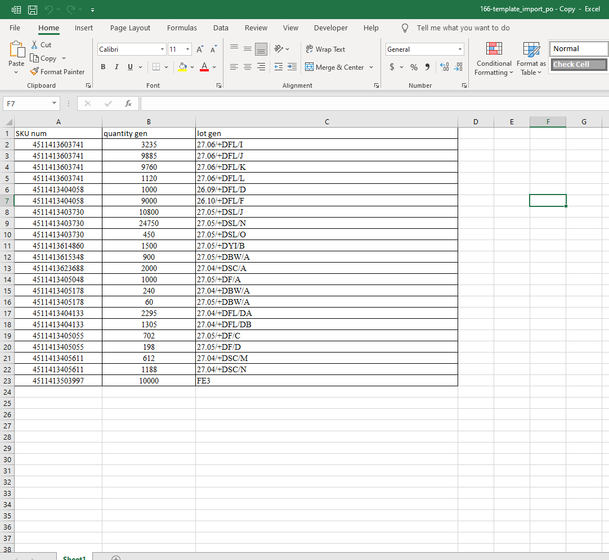

# Mua hàng
**1. Tạo phiếu mua hàng**
Chức năng này giúp người dùng tạo các phiếu mua hàng

**Bước 1:** Vào menu : ```Mua hàng >> MỚI```


**Bước 2:**  Nhập thông tin bắt buộc trong phiếu mua 
 

+ Chọn nhà cung cấp: Sau khi chọn nhà cung cấp hệ thống mặc định hiển thị loại tiền tệ của nhà cung cấp đã chọn, từ đó hệ thống sẽ lấy giá của sản phẩm theo chính sách giá đã được cấu hình trong Bảng giá của NCC (có thể thay đổi giá).

+ Nhập mã nhà cung cấp.

+ Ngày đặt hàng: hệ thống đang mặc định ngày tạo đơn hàng. Có thể sửa lại ngày đặt hàng.

+ Tab Sản phẩm: Kích Thêm một dòng để thêm thông tin sản phẩm vào đơn mua hàng: sản phẩm, số lượng sản phẩm, đơn vị tính và đơn giá.

+ Kích vào tab Thông tin khác, nhập các thông tin ngày nhận, giao hàng đến (kho nhận hàng), điều khoản thương mại quốc tế (nếu có), đại diện mua hàng, các điều khoản thanh toán, vị thế tài chính (nếu có).

**Bước 3:** Lưu thông tin đã mua hàng, thực hiện next bước để nhập hàng


# 2. Tạo phiếu mua hàng bằng cách import danh sách sản phẩm theo phiếu mua

**Bước 1:** Vào menu : ```Mua hàng >> MỚI```


**Bước 2:** Nhập thông tin bắt buộc trong phiếu mua 
 

+ Chọn nhà cung cấp: Sau khi chọn nhà cung cấp hệ thống mặc định hiển thị loại tiền tệ của nhà cung cấp đã chọn, từ đó hệ thống sẽ lấy giá của sản phẩm theo chính sách giá đã được cấu hình trong Bảng giá của NCC (có thể thay đổi giá).

+ Nhập mã nhà cung cấp.

+ Ngày đặt hàng: hệ thống đang mặc định ngày tạo đơn hàng. Có thể sửa lại ngày đặt hàng.

+ Kích vào tab Thông tin khác, nhập các thông tin ngày nhận, giao hàng đến (kho nhận hàng), điều khoản thương mại quốc tế (nếu có), đại diện mua hàng, các điều khoản thanh toán, vị thế tài chính (nếu có).


Chú ý: Chọn đóng địa ví giao đến:
+ Ví dụ: Kho hà nội chọn giao đến ```Kho KCM:Nhận hàng```
+ Người dùng có thể xem chi tiết phần kho nhận hàng, sẽ nhận vào vị trí nào: như ảnh bên dưới người dùng có thể nhìn thấy mua hàng thành công sẽ được lưu trữ vị trị đích = ```SGN/Nhập hàng```


**Bước 3:** Import file excel như mẫu bên dưới

+ Gồm các thông tin :

    + Skum
    + Số lượng
    + lot

**Bước 4:** Next bước và lưu thông tin hoàn thành phiếu mua

# 1. Danh sách phiếu mua hàng
+ Danh sách phiếu mua gồm thông tin phiếu mua hàng, người mua hàng, trạng thái của phiếu mua.
+ Người dùng có thể vào chi tiết từng phiếu để xem 


