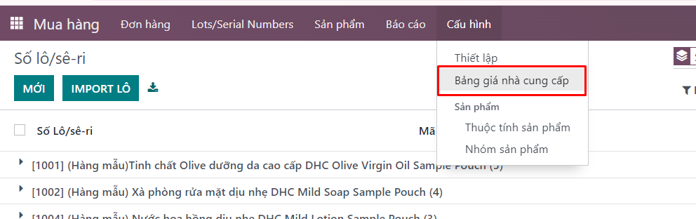
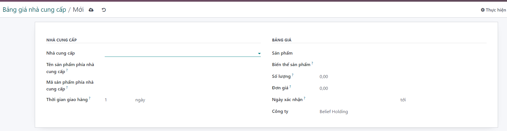
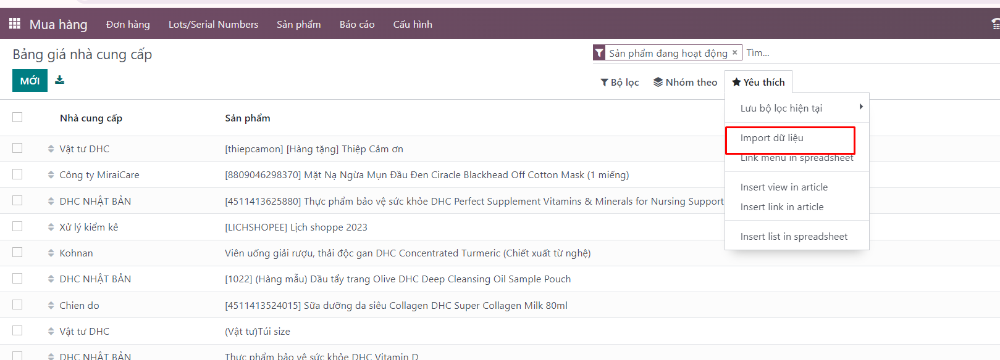

# Quản lý bảng giá
**Tạo bảng giá thủ công**
Chức năng này quản lý bảng giá bán của NCC cho từng sản phẩm. Người dùng có thể theo dõi, cập nhật giá bán của NCC thường xuyên.
Để tạo bảng giá NCC cho sản phẩm, người dùng thực hiện thao tác theo các bước:

**Bước 1:** Người dùng vào menu: Mua hàng >> Cấu hình >> Bảng giá nhà cung cấp >> Kích Tạo.

**Bước 2:** Người dùng nhập các thông tin vào form tạo bảng giá cho sản phẩm. Lưu ý các trường có gạch chân đậm là trường dữ liệu bắt buộc nhập:
Nhà cung cấp: nhà cung cấp sản phẩm. Lưu ý, một sản phẩm có thể tạo nhiều bảng giá với nhiều NCC khác nhau.

+ Tên sản phẩm phía NCC: sử dụng trong trường hợp mình muốn quản lý tên sản phẩm của NCC.

+ Mã sản phẩm phía NCC: sử dụng trong trường hợp mình muốn quản lý Mã sản phẩm của NCC.

+ Biến thể sản phẩm: trường hợp 1 sản phẩm có nhiều biến thể khác nhau thì hệ thống cho phép tạo bảng giá chi tiết đến từng biến thể sản phẩm.

+ Sản phẩm: thông tin sản phẩm tạo bảng giá.

+ Số lượng: Giá/ số lượng.

+ Giá: giá của sản phẩm.

+ Ngày hợp lệ: khoảng thời gian được áp dụng bảng giá.

+ Thời gian giao hàng: thời gian dự kiến hàng về kể từ khi xác nhận đơn hàng.

**Bước 3:** Kích Lưu để lưu lại bảng giá cho sản phẩm.
 
**Tính năng import bảng giá**
Ngoài cách tạo bảng giá thủ công, hệ thống cung cấp file mẫu excel để người dùng nhập dữ liệu:

**Bước 1:** Người dùng chọn menu: Mua hàng >> Cấu hình >> Bảng giá nhà cung cấp >> Nhập.

**Bước 2:** Kích Nạp tập tin >> Chọn file cần import.

**Bước 3:** Kích Kiểm thử để kiểm tra tính hợp lệ của dữ liệu:

TH1: file import có dữ liệu với định dạng hợp lệ và khớp với hệ thống: hệ thống hiển thị dòng chữ màu xanh Các dữ liệu gần như hợp lệ.

TH2: file import có dữ liệu với định dạng không khớp với hệ thống: hệ thống hiển thị dòng dữ liệu chức giá trị không khớp. Khi gặp trường hợp này, người dùng cần nhập lại thông tin dữ liệu đúng vào file import rồi thực hiện import lại.

**Bước 4:** Kích Nhập để thực hiện nhập các dữ liệu vào hệ thống.

 
 
 