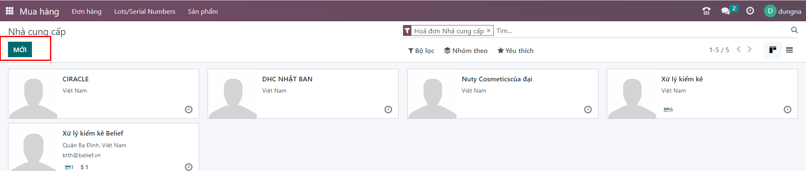
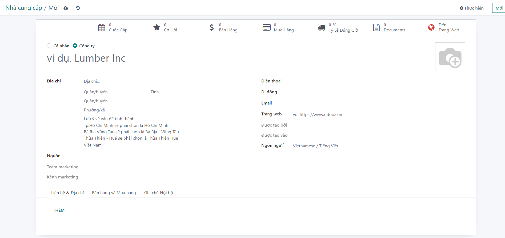
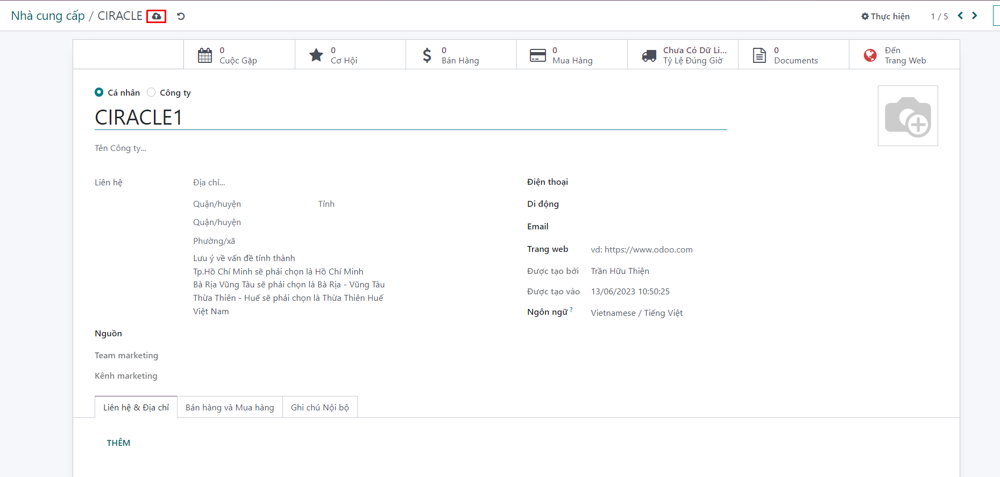
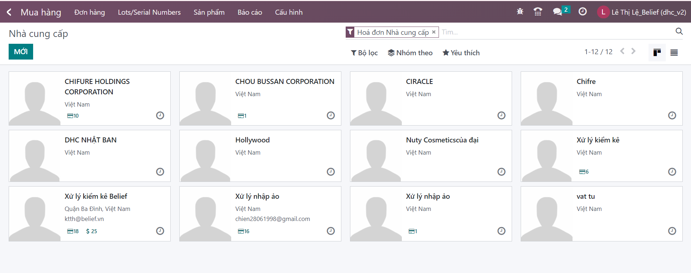

# Quản lý thông tin NCC
**1.Quản lý thông tin NCC**
Tính năng này hỗ trợ người dùng lưu trữ và quản lý thông tin của tất cả NCC của doanh nghiệp được người dùng đưa lên.


**Bước 1:** Người dùng đi đến menu: Mua hàng >> Đơn hàng >> Nhà cung cấp.


**Bước 2:** Kích nút ```Mới``` để mở màn hình thông tin NCC.



**Bước 3:** Nhập các thông tin của NCC:

+ Người dùng nhập những thông tin chung của NCC: tên, địa chỉ, số điện thoại, …

+ Người dùng cấu hình các thông tin khác liên quan đến NCC:

+ Các liên lạc & Địa chỉ: Kích vào nút Thêm để mở màn hình tạo các liên hệ, địa chỉ xuất hóa đơn, địa chỉ giao hàng, địa chỉ khác hay địa chỉ cá nhân liên quan đến khách hàng. Một khách hàng có thể có nhiều liên hệ hay địa chỉ liên quan.

+ Bán & Mua: chứa các thông tin liên quan đến hoạt động mua và bán liên quan đến khách hàng như nhóm khách hàng, thông tin chăm sóc khi mua hàng, thông tin điều khoản mua hàng (nếu cũng là nhà cung cấp), vị thế tài chính,…

Ghi chú nội bộ: Các thông tin khác nếu có.




**Bước 4:** Người dùng kích Lưu để lưu những thông tin vừa cấu hình.


