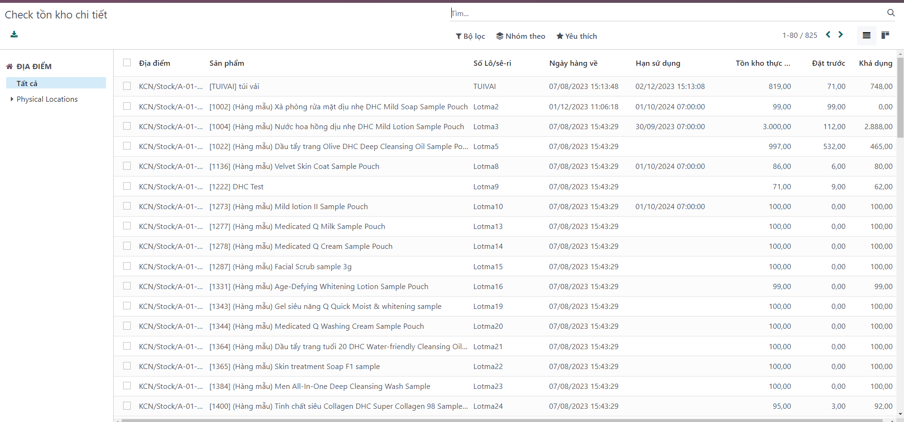

# Tồn kho chi tiết
**Bước 1:** Vào ```Kho vận```

**Bước 2:** Bấm dấu + chọn  ```Tồn kho chi tiết```

**Bước 3:** Hiển thị danh sách tồn kho chi tiết của từng sản phẩm các thông tin ví dụ như:
+ Địa điểm
+ Sản phẩm
+ Số lô
+ ....

**Một số tiện ích hỗ trợ việc xem thông tin**
+ Xuất báo cáo



+ Bộ lọc theo yêu cầu người dùng


+ Nhóm thông tin : Ví dụ nhóm theo Số lô...


+ Yêu thích: ví dụ hỗ trợ người dùng ghim bộ lọc yêu thích lại, lần sau vào không cần lọc lại.

