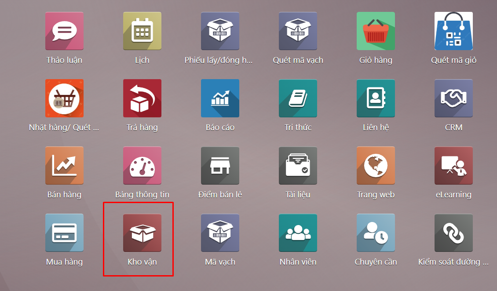
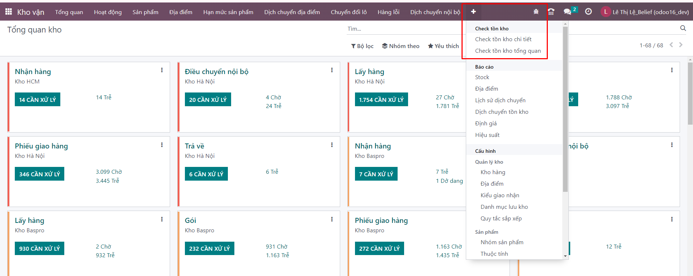
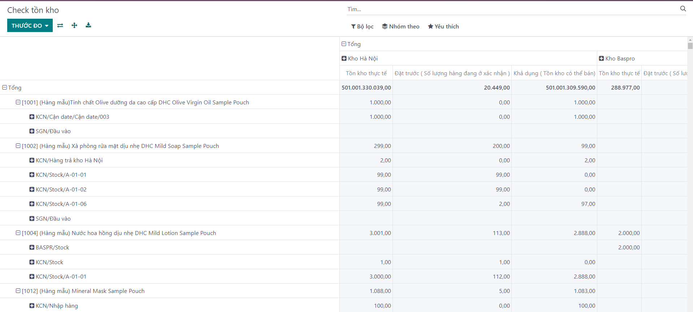
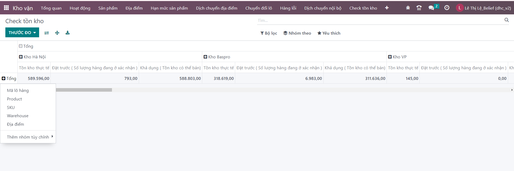
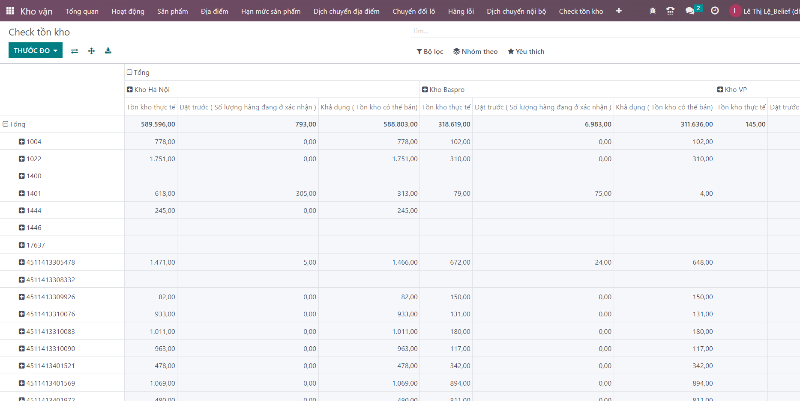
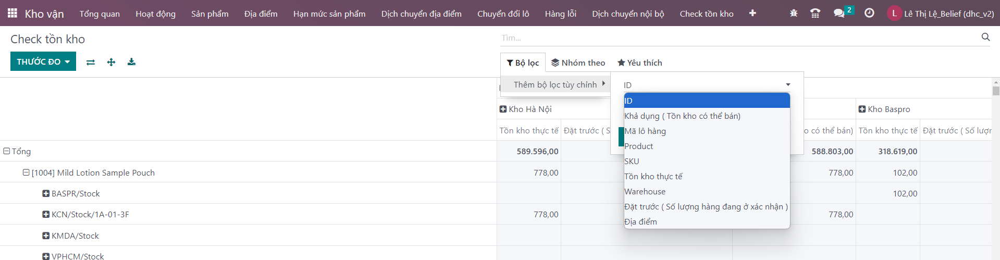
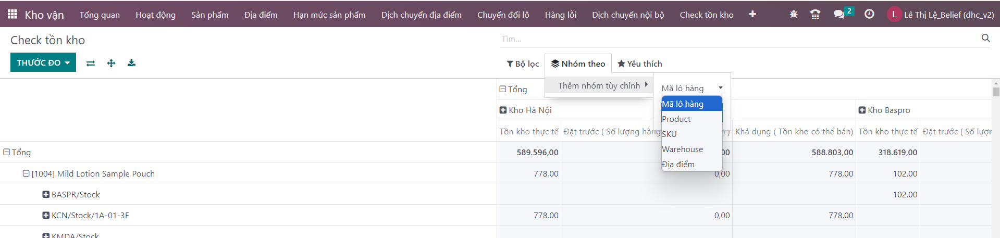
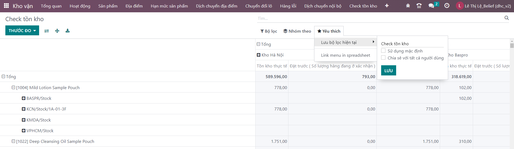

# Tồn kho tổng quan
**Bước 1:** Vào ```Kho vận```



**Bước 2:** Bấm dấu + chọn  ```Tồn kho tổng quan```



**Bước 3:** Hiển thị màn hình báo cáo tổng quan 



**Bước 4:** Người dùng cũng có thể chọn cách hiển thị cột dọc bên trái theo mã lô, sku... Ví dụ bên dưới chọn hiển thị theo SKU




**Một số tiện ích hỗ trợ việc xem thông tin**
+ Xuất báo cáo


+ Bộ lọc theo yêu cầu người dùng



+ Nhóm thông tin : Ví dụ nhóm theo Số lô...



+ Yêu thích: ví dụ hỗ trợ người dùng ghim bộ lọc yêu thích lại, lần sau vào không cần lọc lại.

